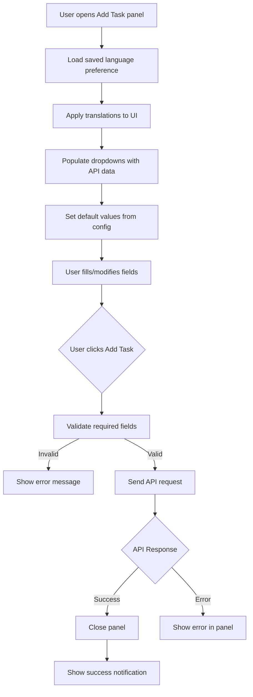

# UI/UX Redesign Plan: Thunderbird OpenProject Extension

## Overview

This plan outlines the changes needed to improve the UI/UX of the Thunderbird OpenProject extension, including:
- Redesigned task creation panel with new fields
- Internationalization support for 10 languages
- Improved visual design and user experience
- Success notifications

## 1. New Task Panel Fields

### Current Fields
- Task content (single-line input)
- Project (multi-select list, size=5)
- Assignee (multi-select list, size=5)
- Include message body (checkbox)
- Add Task button

### New Fields Layout
```
┌─────────────────────────────────────────────┐
│  [OpenProject Icon] Add Task                │
├─────────────────────────────────────────────┤
│  Task                                       │
│  ┌─────────────────────────────────────────┐│
│  │  [Multi-line textarea - 2 rows]         ││
│  └─────────────────────────────────────────┘│
│                                             │
│  Project                                    │
│  [Dropdown selector - default from config]  │
│                                             │
│  Assigned to                                │
│  [Dropdown selector - default from config]  │
│                                             │
│  Responsible                                │
│  [Dropdown selector - blank by default]     │
│                                             │
│  Description                                │
│  ┌─────────────────────────────────────────┐│
│  │                                         ││
│  │  [Multi-line textarea - 4-5 rows]       ││
│  │  [Resizable]                            ││
│  │                                         ││
│  └─────────────────────────────────────────┘│
│                                             │
│  Start Date              End Date           │
│  [Date picker]          [Date picker]       │
│                                             │
│  ┌─────────────────────────────────────────┐│
│  │            Add Task                     ││
│  └─────────────────────────────────────────┘│
│  (Button color: #1a67a3)                    │
└─────────────────────────────────────────────┘
```

## 2. Internationalization (i18n)

### Supported Languages (Top 10 by speakers)
1. **English (en)** - Default
2. **Chinese - Mandarin (zh)** 
3. **Spanish (es)**
4. **Hindi (hi)**
5. **Arabic (ar)**
6. **Portuguese (pt)**
7. **Bengali (bn)**
8. **Russian (ru)**
9. **Japanese (ja)**
10. **French (fr)**

### Translation Strings Structure
```javascript
const translations = {
    en: {
        task: "Task",
        project: "Project",
        assignedTo: "Assigned to",
        responsible: "Responsible",
        description: "Description",
        startDate: "Start Date",
        endDate: "End Date",
        addTask: "Add Task",
        taskCreated: "Task created successfully",
        taskCreationFailed: "Task creation failed",
        selectProject: "Select a project...",
        selectAssignee: "Select assignee...",
        selectResponsible: "Select responsible...",
        // Settings
        apiUrl: "API URL",
        apiKey: "API Key",
        saveToken: "Save Token",
        defaultProject: "Default Project",
        defaultAssignee: "Default Assignee",
        language: "Language",
        // ...
    },
    es: {
        task: "Tarea",
        project: "Proyecto",
        assignedTo: "Asignado a",
        responsible: "Responsable",
        description: "Descripción",
        startDate: "Fecha de inicio",
        endDate: "Fecha de fin",
        addTask: "Añadir tarea",
        taskCreated: "Tarea creada correctamente",
        taskCreationFailed: "Error al crear la tarea",
        // ...
    }
    // ... other languages
};
```

## 3. Files to Modify/Create

### New Files
| File | Purpose |
|------|---------|
| `scripts/i18n.js` | Internationalization system and translations |
| `images/openproject-icon.png` | OpenProject favicon for button |

### Modified Files
| File | Changes |
|------|---------|
| `popup_message.html` | Redesigned form with new fields and labels |
| `popup_compose.html` | Redesigned form with new fields and labels |
| `popup.css` | Improved styling, larger panel, better UX |
| `scripts/common.js` | Handle new fields, date pickers, success notification |
| `scripts/api_utils.js` | Add responsible and dates to API payload |
| `scripts/popup_message.js` | Initialize new fields with defaults |
| `scripts/popup_compose.js` | Initialize new fields with defaults |
| `scripts/settings.js` | Add language preference handling |
| `scripts/settings_utils.js` | Add loadLanguage function |
| `settings.html` | Add language selector dropdown |
| `manifest.json` | Update version, add notifications permission |

## 4. UI/UX Improvements

### Visual Design
- Clean, modern design with proper spacing
- Labels above each field (not placeholders)
- Consistent font sizing and hierarchy
- Proper color scheme matching OpenProject branding
- Hover and focus states for interactive elements

### Form Improvements
- Task field: Multi-line textarea (3-4 rows)
- Project/Assignee/Responsible: Dropdown selectors (not multi-select lists)
- Date pickers: Native HTML5 date inputs
- Description: Multi-line textarea (2-3 rows)
- Button: Include OpenProject icon, prominent styling

### Success Feedback
- Close panel on success
- Show Thunderbird notification: "Task created successfully"
- Include link to the created task if possible

## 5. API Changes

### Updated addTask Function
```javascript
async function addTask(content, projectid, assigneeid, responsibleid, description, startDate, endDate, messageContent) {
    // ... existing type/priority fetching ...
    
    const payload = {
        subject: content,
        description: {
            format: "textile",
            raw: description || messageContent || ""
        },
        startDate: startDate || todayDate,
        dueDate: endDate || null,
        _links: {
            project: { href: "/api/v3/projects/" + parseInt(projectid, 10) },
            // ... type, priority ...
        }
    };
    
    if (assigneeid) {
        payload._links.assignee = { 
            href: "/api/v3/users/" + parseInt(assigneeid, 10) 
        };
    }
    
    if (responsibleid) {
        payload._links.responsible = { 
            href: "/api/v3/users/" + parseInt(responsibleid, 10) 
        };
    }
    
    return requestPost("/api/v3/work_packages", payload);
}
```

## 6. Implementation Order

1. **Phase 1: i18n System**
   - Create `i18n.js` with all translations
   - Add language selector to settings
   - Update settings utilities

2. **Phase 2: UI Redesign**
   - Update `popup.css` with new styles
   - Redesign `popup_message.html`
   - Redesign `popup_compose.html`
   - Download and add OpenProject icon

3. **Phase 3: Functionality**
   - Update `common.js` for new fields
   - Update `api_utils.js` for new API payload
   - Update popup JS files

4. **Phase 4: Polish**
   - Add success notifications
   - Test all languages
   - Final UI adjustments

## 7. Mermaid Diagram: New Form Flow



## 8. Settings Page Updates

### New Language Section
```html
<div class="popup-label">Language / Idioma / 语言:</div>
<div class="popup-input">
    <select id="language">
        <option value="en">English</option>
        <option value="es">Español</option>
        <option value="zh">中文</option>
        <option value="hi">हिन्दी</option>
        <option value="ar">العربية</option>
        <option value="pt">Português</option>
        <option value="bn">বাংলা</option>
        <option value="ru">Русский</option>
        <option value="ja">日本語</option>
        <option value="fr">Français</option>
    </select>
</div>
```


I've completed the UI/UX redesign of the Thunderbird OpenProject extension. Here's a summary of all changes:

## Files Created
- [`thunderbird-openproject/scripts/i18n.js`](thunderbird-openproject/scripts/i18n.js) - Internationalization system with 10 languages (English, Chinese, Spanish, Hindi, Arabic, Portuguese, Bengali, Russian, Japanese, French)
- [`thunderbird-openproject/images/openproject-icon.png`](thunderbird-openproject/images/openproject-icon.png) - OpenProject favicon for the header

## Files Modified

### UI Files
- [`thunderbird-openproject/popup_message.html`](thunderbird-openproject/popup_message.html) - Redesigned task panel with:
  - Header with OpenProject icon
  - Task field (2-row textarea)
  - Project dropdown (default from config)
  - Assigned to dropdown (default from config)
  - Responsible dropdown (blank by default)
  - Description field (4-row resizable textarea)
  - Start/End date pickers
  - Include message body checkbox
  - Add Task button (#1a67a3 color)

- [`thunderbird-openproject/popup_compose.html`](thunderbird-openproject/popup_compose.html) - Same redesign for compose window

- [`thunderbird-openproject/popup.css`](thunderbird-openproject/popup.css) - Improved styling:
  - Wider panel (420px)
  - Modern form styling with labels above fields
  - Focus states with OpenProject blue accent
  - Error/success message styling
  - Date row with side-by-side layout

### Settings
- [`thunderbird-openproject/settings.html`](thunderbird-openproject/settings.html) - Added language selector and default responsible field
- [`thunderbird-openproject/scripts/settings.js`](thunderbird-openproject/scripts/settings.js) - Handle language preference and new fields
- [`thunderbird-openproject/scripts/settings_utils.js`](thunderbird-openproject/scripts/settings_utils.js) - Added `loadDefaultResponsible()` function

### JavaScript Logic
- [`thunderbird-openproject/scripts/common.js`](thunderbird-openproject/scripts/common.js) - Updated to handle new fields (responsible, dates, description), success notifications
- [`thunderbird-openproject/scripts/api_utils.js`](thunderbird-openproject/scripts/api_utils.js) - Updated `addTask()` to include responsible, startDate, dueDate
- [`thunderbird-openproject/scripts/popup_message.js`](thunderbird-openproject/scripts/popup_message.js) - Updated for new form structure
- [`thunderbird-openproject/scripts/popup_compose.js`](thunderbird-openproject/scripts/popup_compose.js) - Updated for new form structure

### Manifest
- [`thunderbird-openproject/manifest.json`](thunderbird-openproject/manifest.json) - Added "notifications" permission, version bumped to 0.6

## Key Features
1. **Internationalization**: 10 languages supported with automatic translation
2. **New Fields**: Responsible person, Start date, End date, Description
3. **Better UX**: Dropdown selectors instead of multi-select lists, date pickers default to today
4. **Success Notification**: Thunderbird notification when task is created successfully
5. **OpenProject Branding**: Icon in header, blue button (#1a67a3)

To test, reload the extension in Thunderbird and try creating a task from an email.
